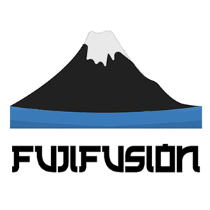

# 

Fujifusion is our group's submission for Hack MIT 2018 [[Devpost](https://devpost.com/software/fujifusion-hackmit2018)].  It is a data-driven application for predicting corporate credit ratings. Project won 1st place for 'Best Use of AI, ML, & Data Science' by RBC Capital Markets.

## Problem
Scholars and regulators generally agree that credit rating agency failures were at the center of the 2007-08 global financial crisis.

## Solution
* Train a machine learning model to automate the prediction of corporate credit ratings.
* Compare vendor ratings with predicted ratings to identify discrepancies.
* Present this information in a cross-platform application for RBC’s traders and clients.

## Data 
Data obtained from RBC Capital Markets consists of 20 features recorded for 27 companies at multiple points in time for a total of 524 samples. Available on Github [here](https://github.com/skumarmars/fujifusion-hackmit2018/tree/master/RBC_CM-master).

## Analysis
We took two approaches to analyzing the data: a supervised k-nearest neighbors approach to predict corporate credit ratings and an unsupervised approach to try to cluster companies into scoring groups.

## Product
We present a cross-platform application built using Ionic that works with Android, iOS, and PCs. Our platform allows users to view their investments, our predicted credit rating for each company, a vendor rating for each company, and visual cues to outline discrepancies. They can buy and sell stock through our app, while also exploring other companies they would potentially be interested in investing in.

## Team

# 